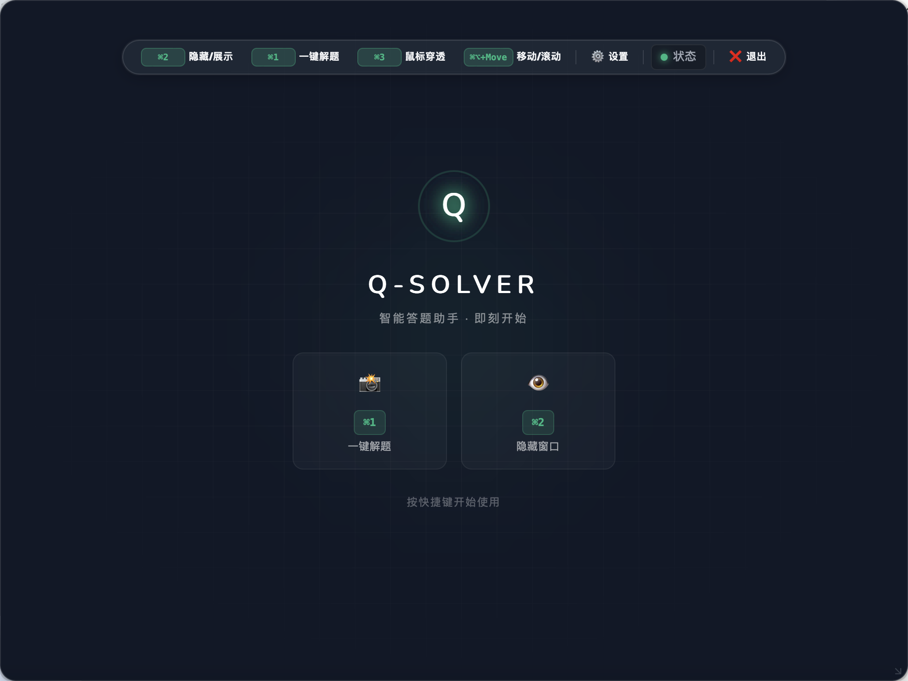
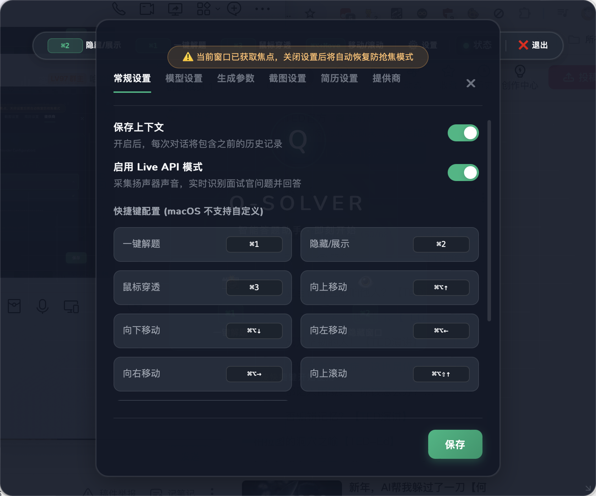
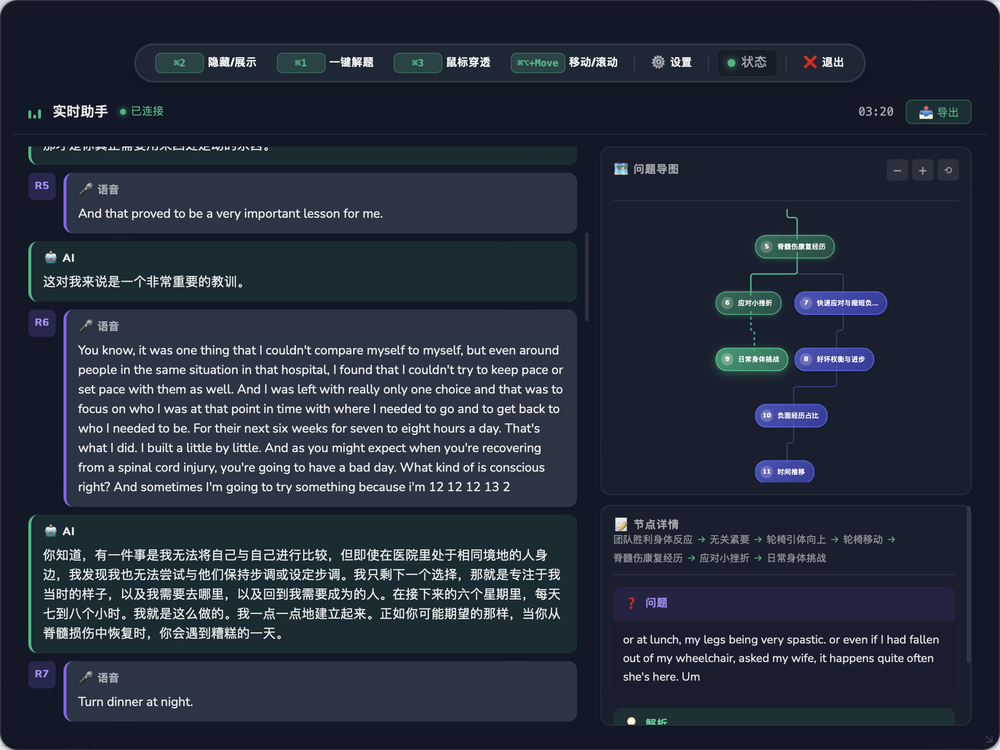
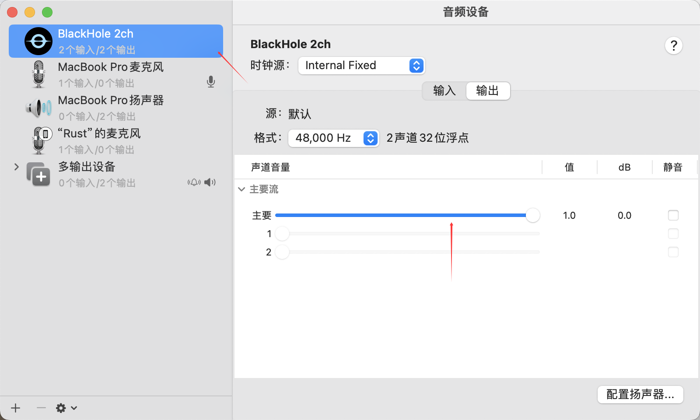

<div align="center">
  

  <br>

  <h1>🧠 Q-Solver</h1>
  
  <h3>AI-Powered Real-Time Desktop Assistant · Screen Analysis · Voice Chat</h3>
  
  <p><i>🎯 Snapshot → Think → Solve. Your invisible AI Co-pilot.</i></p>

  <p>
    <a href="https://github.com/jym66/Q-solver/stargazers"></a>
    <a href="https://github.com/jym66/Q-solver/releases"></a>
    
    
    
  </p>
  
  <p>
    
    
  </p>

  <br>

  <p>
    <a href="#-features">Features</a> •
    <a href="#-quick-start">Install</a> •
    <a href="#-demo">Demo</a> •
    <a href="#-shortcuts">Shortcuts</a> •
    <a href="README.md">中文文档</a>
  </p>
  
  <br>
  
  

</div>

<br>
<br>

> [!CAUTION]
> **🚧 Development Status**: This project is currently in **Pre-Alpha**. Features may change significantly. Proceed with caution.

<br>

> [!NOTE]
> **📌 Attribution**: This project is forked from [whale-coding/Q-solver](https://github.com/whale-coding/Q-solver) under the [CC BY-NC 4.0](LICENSE) license. Improvements over the original: screen capture protection fix (effective on launch), Administrator-level always-on-top against exam software, 200ms topmost heartbeat, stealth status indicator in top bar.

<br>

<div align="center">

## 🌟 Core Highlights

</div>

<table>
<tr>
<td width="50%" valign="top">

### 🖼️ Instant Screen Solving
Capture any part of your screen and get an instant AI analysis with a single hotkey.
- **📸 Smart Recognition**: Accurately recognizes text, math formulas, and code.
- **🧠 Deep Thinking**: Powered by extensive reasoning models like o1 and Claude 3.5.
- **⚡️ Zero Distraction**: Floating ghost window designed not to interrupt your flow.

</td>
<td width="50%" valign="top">

### 🎙️ Immersive Voice Chat
Integrated with Google Gemini Live API for a seamless real-time conversation experience.
- **🗣️ Natural Interaction**: Millisecond latency, feels just like a human call.
- **🗺️ Auto Mind Map**: Visualizes your conversation structure automatically.
- **📝 Smart Notes**: Auto-transcribes and summarizes key points.

</td>
</tr>
</table>

<br>

<div align="center">

## ✨ Core Features

</div>

### 🛡️ Stealth Mode

Designed for privacy and multitasking, offering a "Ghost Window" experience.

> ⚠️ **Note**: Please test the actual effect yourself.

| Feature | Description |
|:---|:---|
| **🚫 Recording Proof** | Invisible to most screen recording/sharing software. Protection applies immediately on launch — the "Toggle Visibility" button in the top bar lights up when active. |
| **👻 Click-Through** | Enable to interact with content behind the window seamlessly. |
| **📌 Aggressive Always-on-Top** | Runs with Administrator privileges and reasserts top position every 200ms, resistant to focus-stealing by exam/proctoring software. |
| **🔕 Focus Guard** | Intelligently manages window focus to avoid stealing keystrokes. |

> 💡 **Exam Software Compatibility**: Q-Solver runs at High Integrity (Administrator), so its hotkeys cannot be intercepted by keyboard hooks from exam applications running at normal privilege.

---

### 🧠 Model Ecosystem

**Supports OpenAI / Gemini / Claude / DeepSeek (Custom) and more.**

- **Live API**: Experience millisecond-latency voice chat with Gemini 2.0.
- **Custom Models**: Compatible with any OpenAI format API.

---

<br>

<div align="center">

## 📸 Interface Showcase

</div>

| | | |
|:---:|:---:|:---:|
|  |  |  |

<br>
<br>

## 🚀 Quick Start

### 📥 Option 1: Download App (Recommended)

Get the latest installer for your OS from the [Releases Page](https://github.com/jym66/Q-solver/releases).

> [!NOTE]
> **macOS Notice**: If you see a "Damage" or "Unidentified Developer" warning, run:
> ```bash
> xattr -cr /Applications/Q-Solver.app
> chmod +x /Applications/Q-Solver.app/Contents/MacOS/Q-Solver
> ```

### 🛠️ Option 2: Build from Source

**Prerequisites**: Go 1.25+, Node.js 22+, Wails CLI, GCC (Windows requires MSYS2 MinGW)

```bash
# 1. Install Wails
go install github.com/wailsapp/wails/v2/cmd/wails@latest

# 2. Clone repo
git clone https://github.com/jym66/Q-solver.git
cd Q-Solver

# 3. Dev mode (Hot Reload) — must run as Administrator
wails dev

# 4. Build Production (generates both exe and NSIS installer)
wails build -nsis
```

> [!NOTE]
> **Windows Build Note**: Install [MSYS2](https://www.msys2.org/) and run `pacman -S mingw-w64-x86_64-gcc` to get GCC. Add `C:\msys64\mingw64\bin` to PATH before building. Since the app manifest requires Administrator, `wails dev` must also be run from an elevated terminal.

<br>

## ⌨️ Shortcuts

> 💡 **Tip**: Shortcuts are currently fixed on macOS. Windows supports custom shortcuts (defaults below).

| Action | Windows | macOS |
|:---|:---:|:---:|
| **Snapshot & Solve** 📸 | `F8` | `⌘ + 1` |
| **Toggle Visibility** 👁️ | `F9` | `⌘ + 2` |
| **Toggle Click-Through** 👻 | `F10` | `⌘ + 3` |
| **Nudge Window** ↕️ | `Alt + Arrows` | `⌘⌥ + Arrows` |
| **Fast Scroll** 📜 | `Alt + PgUp/Dn` | `⌘⌥⇧ + ↑/↓` |

<br>

## ⚙️ Configuration

1. Click the **Settings** icon (top-right).
2. Select text **Provider** (e.g., Gemini, OpenAI).
3. Paste your **API Key**.
4. (Optional) Enable **Live API** for voice features.

### 🍎 macOS Setup

macOS requires specific permissions for full functionality:

<details>
<summary><b>🔐 Screen Recording (Required)</b></summary>

For screen analysis:
1. You should see a system prompt on first launch.
2. If not, go to **System Settings** -> **Privacy & Security** -> **Screen Recording**.
3. Toggle **Q-Solver** ON.
4. **Restart** the app.

</details>

<details>
<summary><b>🎙️ System Audio Capture (For Live API)</b></summary>

To let the AI hear computer audio (e.g., meetings), you need a virtual audio driver:

1. Install [BlackHole](https://github.com/ExistentialAudio/BlackHole):
   ```bash
   brew install blackhole-2ch
   ```
2. Open **Audio MIDI Setup**.
3. Create a **Multi-Output Device**. Check both your **Speakers** and **BlackHole 2ch**.
4. Set this Multi-Output Device as your system output.
5. In Q-Solver Settings, ensure Audio Input includes BlackHole.



</details>

<br>

## 🛠️ Tech Stack

- **Core**: [Go](https://go.dev/) (Logic) + [Wails](https://wails.io/) (Binding)
- **UI**: [Vue 3](https://vuejs.org/) + [Vue Flow](https://vueflow.dev/) (Mind Map)
- **AI**: Gemini Protocol, OpenAI SDK
- **Audio**: Miniaudio (via malgo), BlackHole

<br>

## 📈 Star History

<div align="center">
  <a href="https://star-history.com/#jym66/Q-solver&Date">
    <picture>
      <source media="(prefers-color-scheme: dark)" srcset="https://api.star-history.com/svg?repos=jym66/Q-solver&type=Date&theme=dark" />
      <source media="(prefers-color-scheme: light)" srcset="https://api.star-history.com/svg?repos=jym66/Q-solver&type=Date" />
      
    </picture>
  </a>
</div>

<br>

## 📄 License

Distributed under the **CC BY-NC 4.0** License. Intended for **personal, non-commercial use only**.

---

<div align="center">
  <p>Made with ❤️ by <a href="https://github.com/jym66">jym66</a></p>
  <p>
    If you enjoy using Q-Solver, please leave a <b>⭐ Star</b>!
  </p>
</div>
